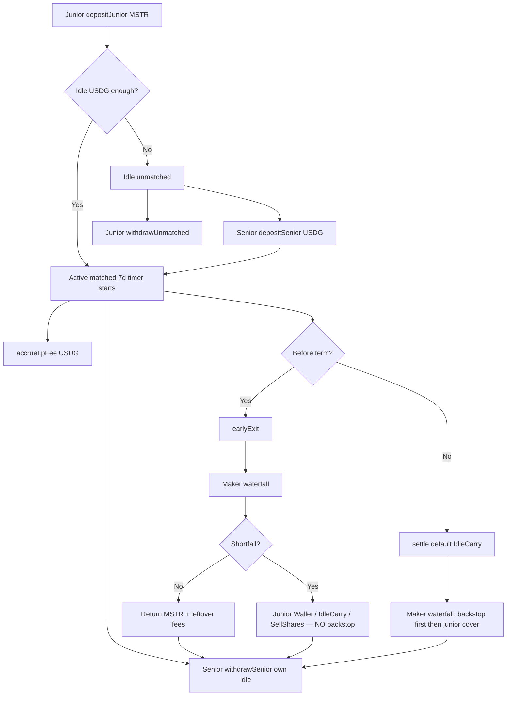

# Carry / Levered LP Vault — Contract Pack

Grant- and audit-oriented reference for `contracts/src/LeveredLpVault.sol` (UUPS implementation).  
Deploy steps live in [`CARRY_TESTNET.md`](./CARRY_TESTNET.md).  
Docs index: [`docs/README.md`](./docs/README.md).  
Maker-locked product rules + research sync: [`docs/MAKER_V1_NOTES.md`](./docs/MAKER_V1_NOTES.md).  
**Fee waterfall (product source of truth):** [`docs/MAKER_FEE_WATERFALL.md`](./docs/MAKER_FEE_WATERFALL.md) — Morpho-rate senior floor, treasury/seniorPerf/junior split **only** at claimFees / earlyExit / settle.  
**Accounting (v2.5 source of truth):** [`docs/ACCOUNTING_V25.md`](./docs/ACCOUNTING_V25.md).

**Live product CA (UUPS PROXY):** [`0xc80108649B3ba2e5B040c79DDE3af0cB979b72bd`](https://explorer.testnet.chain.robinhood.com/address/0xc80108649B3ba2e5B040c79DDE3af0cB979b72bd) — `version() = v2.5-funder-idle`.  
**Implementation:** [`0xe498F43ED10a37E22Fe046A3FDAAFD4E9080d0e8`](https://explorer.testnet.chain.robinhood.com/address/0xe498F43ED10a37E22Fe046A3FDAAFD4E9080d0e8).  
**Site:** [usecarry.io](https://usecarry.io).

Live product includes Maker waterfall (base 20% + Boosted STRATEGY **tiers** 15/10/5%), unpaid-accrual carry, rate lock ≤5%, settle/early shortfall cover, early-exit cover revert, gasCredit auto-refund, SellShares AMM stub, auto-compound, **per-lender idle**, **FIFO funders**, yield to **position funders**, $25 min, $25k market totals, **no per-wallet cap**, settle default **IdleCarry**.

**v1 grant reference (not in use):** `0x72A0…36c8` (immutable; old 4%/5%/fee-in cut story applies only there).

**Status:** EVM testnet. DualPool hook is **NOT IMPLEMENTED** (`dualPoolAdapter() == address(0)`). LP fees on testnet are pushed via `accrueLpFee` / `MockFeePool` (fee-donor path for demos). No Yieldz or Morpho ERC-4626 sleeve. Morpho rate / Idle USDG display rates are config stubs. Boosted is an on-chain STRATEGY stake-tier stub (no fake STRATEGY yield minted).

---

## 1. Overview

### Plain language

Carry lets a stock-token holder (junior) and a USDG lender (senior) form a **50/50 book**: junior posts MSTR, senior posts matching USDG. The intended production product runs that inventory in a Uniswap v4 DualPool-style hook at ~2× notional so the depositor’s equity tracks the stock while the pair earns swap fees.

This vault is the **custody + accounting layer** for that product on testnet:

- Junior deposits MSTR → **Idle** (unmatched) until USDG is available, then **Active**. Product states: **Idle / Active / Boosted / Closed**.
- Active window is **7 days** (product copy: “active”, not “locked”; positions roll over, never auto-close).
- **Live UUPS product:** senior accrual = locked Morpho native supply rate (stub **3.9%**, owner cap **≤5%**) × elapsed; fee waterfall at claim/exit/settle only (see [`docs/MAKER_FEE_WATERFALL.md`](./docs/MAKER_FEE_WATERFALL.md)).
- **Early exit cover:** junior chooses Wallet / IdleCarry / SellShares (**NO backstop**). **Settle:** backstop first, then junior Wallet / IdleCarry / SellShares; **default settle mode = IdleCarry** (testnet SellShares → extra MSTR to seniors; mainnet will switch to AMM).
- Lenders withdraw **their own idle** USDG anytime (`seniorIdle` / `freePrincipal`); **matched** USDG returns to that lender’s idle when the position closes (or rematches via auto-compound).

### For auditors

| Item | Value |
| --- | --- |
| Contract | `LeveredLpVault` / `LeveredLpVaultV2` behind UUPS PROXY |
| Tokens | Immutable `mstr`, `usdg` ERC-20s |
| Oracle | Immutable `IPriceOracle` (`mstrPriceWad()`) |
| Term | Immutable `term` ≤ 7 days |
| Morpho rate | Owner-set `morphoRateWad` ≤ `MAX_MORPHO_RATE_WAD` (5%); locked per position at first match |
| Fee split | Maker waterfall at claim/exit/settle; treasury base 20% + Boosted tiers + seniorPerf 20% |
| Accounting | Per-lender `seniorIdle`; FIFO funder slices; yield by amount × time matched **on that position** |
| Caps | `minDepositUsdg` $25; `maxTotalSeniorUsdg` / `maxTotalJuniorUsdg` $25k; `maxPerWalletUsdg` **0 = unlimited** |
| Unpaid accrual | Carried on `Position.unpaidSeniorAccrual` when fees &lt; accrual |
| Pause | Owner pause/unpause deposits only (auto-compound reopen bypasses pause + caps) |
| Pool | No approvals to PoolManager; `joinPool` always reverts |
| Reentrancy | `nonReentrant` on all value-moving externals |

Inventory stays in the vault until a reviewed DualPool adapter exists. Mark-to-market `mark()` reports 2× equity as “hold the MSTR” vs an unlevered 50/50 √p comparison; it does **not** move inventory.

---

## 2. Actors

| Actor | Role | Key actions |
| --- | --- | --- |
| **Junior** (stock depositor) | Posts MSTR | `depositJunior`, `withdrawUnmatched`, `earlyExit`, `fundGasCredit`, `setAutoCompound`; receives leftover MSTR/fees on settle |
| **Senior** (lender) | Posts USDG | `depositSenior`, `withdrawSenior` (own idle + claims), `seniorEarlyExit` |
| **Owner / protocol** | Pause + upgrade + knobs | `pause`, `unpause`, `upgradeToAndCall`, caps/tiers/rate, `rescueToken` (non-principal only). **Cannot** pull MSTR/USDG principal |
| **Mock pool / fee donor** | Simulates LP fees | `accrueLpFee` / `MockFeePool.payFee` pushes USDG in |
| **Anyone** | Keepers | `settle` after term when residual cover is zero (proceeds still go to junior + seniors, not caller) |

**NOT IMPLEMENTED as separate actors:** Morpho idle allocator, live STRATEGY token (stake amount is owner-settable stub), geoblock, DualPool hook, Yieldz.

---

## 3. Lifecycle



Numbered happy path:

1. **Deposit stock** — `depositJunior(mstrAmount)` (≥ $25 notional). Partial match OK; residual stays in Idle queue.
2. **Lend USDG** — `depositSenior(amount)` (≥ $25). FIFO-matches Idle juniors; records funder slices; first match locks `morphoRateLocked` / `treasuryCutLocked` and starts the term clock. No further match after term.
3. **Active** — Timer = `term` from first match. Accrual uses locked Morpho rate (≤5%).
4. **Fee accrual** — `accrueLpFee` pulls raw USDG onto the position (no cut on fee-in).
5. **claimFees / early exit / settle** — Maker waterfall only here. Unpaid senior accrual carries when fees &lt; accrual. Yield credits go to **that position’s funders**. Early cover: junior Wallet / IdleCarry / SellShares (NO backstop). Settle: backstop first, then junior cover modes; default IdleCarry.
6. **Lender exit** — `freePrincipal(lender) = seniorIdle[lender]`; matched principal returns to that lender’s idle on close.

---

## 4. Function reference

### Admin

| Function | Who | Preconditions | Effects / funds |
| --- | --- | --- | --- |
| `pause()` | owner | — | `paused = true`; new deposits revert |
| `unpause()` | owner | — | `paused = false` |
| `rescueToken(token,to,amount)` | owner | `token ∉ {mstr,usdg}` | Transfers non-principal token |
| `upgradeToAndCall` | owner (UUPS) | — | Swaps implementation behind same PROXY |
| Caps / tiers / rate / gas | owner | — | `setDepositCaps`, `setMinDepositUsdg`, `setBoostTiers`, `setMorphoRate`, `setGasRefundWei`, … |

### Junior

| Function | Who | Preconditions | Effects / funds |
| --- | --- | --- | --- |
| `depositJunior(mstrAmount)` | anyone (when unpaused) | amount > 0; min notional | Pulls exact MSTR; enqueues Idle; tries match |
| `withdrawUnmatched(positionId)` | position owner | Idle, not settled | Returns all MSTR; refunds unused gasCredit |
| `earlyExit(positionId[, mode])` | position owner | Matched, before term, not settled | Closes position; Maker waterfall; cover Wallet / Idle / SellShares |
| `fundGasCredit` / `withdrawGasCredit` | junior | — | ETH escrow for open-queue matcher gas refunds |
| `setAutoCompound(bool)` | wallet | — | Opt in/out of compounding capital+fees into Idle |

### Senior

| Function | Who | Preconditions | Effects / funds |
| --- | --- | --- | --- |
| `depositSenior(amount)` | anyone (when unpaused) | amount > 0; min | Pulls exact USDG; credits `seniorIdle`; FIFO match |
| `withdrawSenior(principalAmount)` | senior | `principalAmount ≤ freePrincipal` (= own idle) | Returns own idle principal + claimable yield USDG + claimable MSTR |
| `seniorEarlyExit` | senior funder | matched slice | Returns matched principal to idle / rematch path; no senior early-withdraw fee |

### Fees / backstop

| Function | Who | Preconditions | Effects / funds |
| --- | --- | --- | --- |
| `accrueLpFee(positionId, amount)` | anyone | Matched, not settled | Pulls exact USDG raw onto position (no cut) |
| `claimFees(positionId)` | junior | Matched, before term | Maker waterfall; unpaid accrual carries forward |
| `fundBackstop(amount)` | anyone | amount > 0 | Pulls USDG into `backstop` |

### Settlement / views

| Function | Who | Preconditions | Effects / funds |
| --- | --- | --- | --- |
| `settle(positionId[, mode])` | anyone (if residual cover 0) / junior | Matched, term elapsed, not settled | Maturity waterfall; default IdleCarry; **no MSTR sold** unless SellShares chosen |
| `previewEarlyExit` / `previewClaimFees` | view | — | Mode-aware accrual + waterfall preview |
| `previewSeniorAssets` / `previewMstrToCover` | view | — | Quoting helpers |
| `seniorIdle` / `freePrincipal` / `isMatched` / `mark` | view | — | Per-lender idle / capacity / MTM |
| `dualPoolAdapter()` | view | — | Always `address(0)` |
| `joinPool(bytes)` | anyone | — | Always reverts `ExternalLpForbidden` |

Initializer config: `mstr`, `usdg`, `oracle`, `term`, `morphoRateWad` (≤5%), owner.

---

## 5. Accounting

### What “whole” means

If fees cover Morpho-rate senior accrual for the matched window, seniors are made whole on opportunity cost and juniors keep remaining MSTR at settle (no share sale unless SellShares cover).

### Senior accrual (implemented)

```
accrual = unpaidSeniorAccrual
        + seniorPrincipal * morphoRateLocked * elapsed / (WAD * YEAR)
```

Maker waterfall at claim/exit/settle: `seniorFloor → treasury(cut) → seniorPerf → junior`. Early-exit shortfall: junior only (NO backstop). Settle shortfall: backstop first, then junior Wallet / IdleCarry / SellShares. Junior gas credit: see `docs/GAS_CREDIT.md`.

### v2.5 idle + funders

See [`docs/ACCOUNTING_V25.md`](./docs/ACCOUNTING_V25.md). Summary:

- `freePrincipal(lender) = seniorIdle[lender]` (own idle only)
- Matching records FIFO `FunderSlice` rows on each position
- Senior USDG/MSTR credits split by **amount × time matched on that position**
- IdleCarry burns only the junior’s own idle

### Fee credit path

`accrueLpFee` requires **exact** transfer (`FeeOnTransfer` if balance delta ≠ amount). Fees accrue raw onto the position; cut happens only at waterfall time.

### Senior claims

On settle/early exit/claimFees, USDG paid toward seniorFloor + seniorPerf credits position funders; SellShares cover can credit MSTR. Seniors harvest via `withdrawSenior`.

---

## 6. Security model

| Control | Behavior |
| --- | --- |
| Pause | Blocks `depositJunior` / `depositSenior` only. Exit/settle/withdraw still work |
| Owner powers | Pause/unpause, UUPS upgrade, caps/tiers/rate, rescue junk tokens, treasury/backstop withdraw knobs |
| Owner cannot | Withdraw MSTR/USDG principal via rescue |
| Reentrancy | `nonReentrant` on deposits, withdraws, fees, early exit, settle, rescue |
| CEI | State + events updated before external token pushes on exit paths |
| Fee-on-transfer | Rejected (`FeeOnTransfer`) on pulls |
| External LP | `joinPool` forbidden; no PoolManager allowance |
| Oracle | Immutable address; production must use a non–owner-writable feed. `MockOracle` is testnet-only and **has a setter** |

### Invariants (intended)

1. Per-lender idle + matched funder slices reconcile to each lender’s principal
2. Settled positions never pay twice (`settled` latch)
3. Owner rescue cannot touch `mstr` / `usdg`
4. Matched MSTR leaves only via junior payout or senior MSTR claims after sale-to-cover
5. `dualPoolAdapter() == 0` and no PoolManager approvals

### Known limitations (NOT bugs for grant bar — be explicit)

| Limitation | Status |
| --- | --- |
| DualPool / Uni v4 hook | **NOT IMPLEMENTED** |
| Real swap fee routing | **NOT IMPLEMENTED** (mock `accrueLpFee`) |
| Morpho idle sleeve | **NOT IMPLEMENTED** (rate stub only) |
| Live STRATEGY token | Stake amount / tiers are owner-settable stubs; no STRATEGY yield minted |
| Partial exits of a single position | Full close on earlyExit / settle |
| SellShares AMM | Interface live; testnet `sellSharesRouter=0` (MSTR→seniors accounting) |
| Impl size vs EIP-170 | v2.5 ~32KB; OK on RH testnet; **must shrink for mainnet** |
| Robinhood testnet Uni v4 | **No official Uniswap deploy on 46630** — mocks required |

More: [`docs/SECURITY_V2.md`](./docs/SECURITY_V2.md).

---

## 7. Threat notes

| Attack / misuse | Mitigation | Test |
| --- | --- | --- |
| Random drains senior/junior funds | No open withdraw; settle pays owners not caller | `test_randomAddressCannotPullFunds` |
| Owner steals principal via rescue | `PrincipalToken` revert | `test_ownerCannotStealPrincipal` |
| Double early exit / settle | `AlreadySettled` | `test_earlyExitCannotDoubleExit` |
| Attacker early-exits someone else | `NotJunior` | `test_earlyExitOnlyJunior` |
| Early exit after term | `TermElapsed`; must `settle` | `test_earlyExitBlockedAfterTerm` |
| Fee on unmatched position | `NotMatched` | `test_accrueFeesRequiresMatched` |
| Deposit while paused | `Paused` | `test_pauseBlocksNewDeposits` / `test_startsPaused` |
| External LP beside vault | `ExternalLpForbidden` | `test_externalCannotLpBesideVault` |
| Lender pulls another lender’s idle | Per-lender `seniorIdle` | `test_liveBug_perLenderIdle_noCrossContamination` |
| Reentrancy on token callbacks | `nonReentrant` | Covered by modifier on value paths |
| Fee-on-transfer silent credit | Balance delta check | `FeeOnTransfer` in `_pullExact` |
| Mainnet accidental broadcast | Deploy scripts refuse 4663/1 or stay disarmed | `test_broadcastDisarmed`; `DeployCarryTestnet` |

---

## 8. Carry UI mapping

Live site: [usecarry.io](https://usecarry.io). Config: `public/config.json` → `chain.vault` (PROXY).

| Carry screen / control | Vault call | Security / notes |
| --- | --- | --- |
| Deposit MSTR / Deposit {sym} | `mstr.approve` → `depositJunior(amount)` | Pause-gated; Idle if no USDG; min $25 |
| Position badge **Idle** | `!isMatched(id)` | Unmatched; no fees yet |
| Position badge **Active** / **Boosted** | `isMatched(id)` (+ boosted flag) | 7-day timer from `openedAt` |
| Position badge **Closed** | `settled` | After earlyExit / settle |
| Lend / deposit USDG (lender) | `usdg.approve` → `depositSenior(amount)` | FIFO-matches Idle queue; credits own idle |
| Active position view | `positions(id)`, `mark(id)`, `previewEarlyExit(id)` | Read-only |
| **Withdraw Early** (stock) | `earlyExit(id, mode)` | Junior only; Wallet / Idle / SellShares cover |
| Withdraw (Idle / unmatched stock) | `withdrawUnmatched(id)` | Full MSTR back; gasCredit refund |
| Withdraw after 7d / settle | `settle(id[, mode])` | Default IdleCarry; anyone if residual cover 0 |
| Lender withdraw **idle** | `withdrawSenior(freePrincipal(me))` | Own idle only |
| Lender withdraw **matched** | Wait for close / seniorEarlyExit / rematch | Else `InsufficientFree` |
| Auto-compound | `setAutoCompound(bool)` | Exit capital+fees can reopen as Idle |
| Gas credit | `fundGasCredit` / `withdrawGasCredit` | Junior open-queue ETH escrow |
| Fee / rewards display | Driven by `accrueLpFee` (mock) | Real DualPool **NOT WIRED** |
| Morpho idle rate sleeve | — | Config stub only on testnet |
| STRATEGY boost | Owner stake amount + tiers | Stub; treasury cut of **fees** only |
| Geoblock | Frontend/`config.json` only | **NOT on-chain** |

---

## 9. Testnet deploy

See **[`CARRY_TESTNET.md`](./CARRY_TESTNET.md)** (Robinhood Chain Testnet **46630**, faucet, dry-run, broadcast checklist, v2.5 upgrade txs).

Mainnet Robinhood **4663** and Ethereum **1** are refused by the Carry testnet script. The older `DeployLeveredLpVault.s.sol` remains disarmed for 4663 and is **not** the Carry testnet path.

Live Active positions for end-of-term settle testing: [`docs/SETTLE_WATCH.md`](./docs/SETTLE_WATCH.md) (multi-lender idle case documented there; no separate multi-wallet retest file in-repo).

---

## Source paths

| Path | Role |
| --- | --- |
| `contracts/src/LeveredLpVault.sol` | Vault (UUPS impl) |
| `contracts/src/mocks/MockERC20.sol` | Testnet tokens |
| `contracts/src/mocks/MockOracle.sol` | Testnet price (writable — testnet only) |
| `contracts/src/mocks/MockFeePool.sol` | Fee pusher |
| `contracts/src/oracle/FixedPriceOracle.sol` | Frozen oracle (no setter) |
| `contracts/test/LeveredLpVault.t.sol` | Foundry tests |
| `contracts/script/DeployCarryTestnet.s.sol` | RH testnet 46630 deploy |
| `contracts/script/UpgradeCarryVault.s.sol` | UUPS upgrade script (disarmed by default) |
| `contracts/script/DeployLeveredLpVault.s.sol` | Disarmed mainnet-4663 script (not grant path) |
| `public/config.json` | Live addresses + product.onChain flags |
