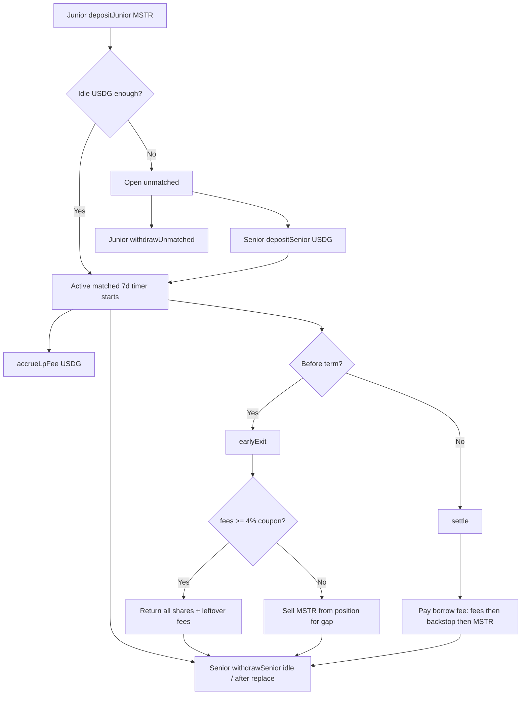

# Carry / Levered LP Vault — Contract Pack

Grant- and audit-oriented reference for `contracts/src/LeveredLpVault.sol`.  
Deploy steps live in [`CARRY_TESTNET.md`](./CARRY_TESTNET.md).  
Historical build notes: [`LEVERED_LP_BUILD.md`](./LEVERED_LP_BUILD.md).  
Maker-locked product rules + research sync: [`docs/MAKER_V1_NOTES.md`](./docs/MAKER_V1_NOTES.md).  
**Fee waterfall (product source of truth):** [`docs/MAKER_FEE_WATERFALL.md`](./docs/MAKER_FEE_WATERFALL.md) — Morpho-rate senior floor, treasury/seniorPerf/junior split **only** at claimFees / earlyExit / settle.

**Live product CA (UUPS PROXY):** [`0xc80108649B3ba2e5B040c79DDE3af0cB979b72bd`](https://explorer.testnet.chain.robinhood.com/address/0xc80108649B3ba2e5B040c79DDE3af0cB979b72bd) — `version() = v2.2-maker-answers`. Maker waterfall, unpaid-accrual carry, rate lock ≤5%, settle/early shortfall cover (backstop first then junior), time-weighted senior yield, owner backstop withdraw, matchCap, deposit caps.  
**v1 grant reference (not product):** `0x72A0…36c8` (immutable; old 4%/5%/fee-in cut story applies only there).

**Status:** EVM testnet. DualPool hook is **NOT IMPLEMENTED** (`dualPoolAdapter() == address(0)`). LP fees on testnet are pushed via `accrueLpFee` / `MockFeePool` (fee-donor path for demos). No Yieldz, Morpho idle sleeve, or STRATEGY burn/boost wiring.

---

## 1. Overview

### Plain language

Carry lets a stock-token holder (junior) and a USDG lender (senior) form a **50/50 book**: junior posts MSTR, senior posts matching USDG. The intended production product runs that inventory in a Uniswap v4 DualPool-style hook at ~2× notional so the depositor’s equity tracks the stock while the pair earns swap fees.

This vault is the **custody + accounting layer** for that product on testnet:

- Junior deposits MSTR → **Idle** (unmatched) until USDG is available, then **Active**. Product states: Idle / Active / Boosted / Closed.
- Active window is **7 days** (product copy: “active”, not “locked”; positions roll over, never auto-close).
- **Live UUPS product:** senior accrual = locked Morpho native supply rate (stub **3.9%**, owner cap **≤5%**) × elapsed; fee waterfall at claim/exit/settle only (see [`docs/MAKER_FEE_WATERFALL.md`](./docs/MAKER_FEE_WATERFALL.md)).
- **Early exit cover:** user chooses Wallet USDG → Idle USDG on Carry → SellShares. **Settle never sells junior MSTR** (treasury/backstop only).
- Lenders withdraw **idle** USDG anytime; **matched** USDG needs replacement liquidity or a position close.

### For auditors

| Item | Value |
| --- | --- |
| Contract | `LeveredLpVault` / `LeveredLpVaultV2` behind UUPS PROXY |
| Tokens | Immutable `mstr`, `usdg` ERC-20s |
| Oracle | Immutable `IPriceOracle` (`mstrPriceWad()`) |
| Term | Immutable `term` ≤ 7 days |
| Morpho rate | Owner-set `morphoRateWad` ≤ `MAX_MORPHO_RATE_WAD` (5%); locked per position at first match |
| Fee split | Maker waterfall at claim/exit/settle; treasury/seniorPerf cuts of gross (Boosted can cut treasury toward 10%) |
| Unpaid accrual | Carried on `Position.unpaidSeniorAccrual` when fees &lt; accrual |
| Pause | Owner pause/unpause deposits only |
| Pool | No approvals to PoolManager; `joinPool` always reverts |
| Reentrancy | `nonReentrant` on all value-moving externals |

Inventory stays in the vault until a reviewed DualPool adapter exists. Mark-to-market `mark()` reports 2× equity as “hold the MSTR” vs an unlevered 50/50 √p comparison; it does **not** move inventory.

---

## 2. Actors

| Actor | Role | Key actions |
| --- | --- | --- |
| **Junior** (stock depositor) | Posts MSTR | `depositJunior`, `withdrawUnmatched`, `earlyExit`; receives leftover MSTR/fees on settle |
| **Senior** (lender) | Posts USDG | `depositSenior`, `withdrawSenior` (idle + claims) |
| **Owner / protocol** | Pause key | `pause`, `unpause`, `rescueToken` (non-principal only). **Cannot** set oracle/term/APR/cut, cannot pull MSTR/USDG |
| **Mock pool / fee donor** | Simulates LP fees | `accrueLpFee` / `MockFeePool.payFee` pushes USDG in |
| **Anyone** | Keepers | `settle` after term (proceeds still go to junior + seniors, not caller) |

**NOT IMPLEMENTED as separate actors:** Morpho idle allocator, STRATEGY booster, geoblock, DualPool hook, Yieldz.

---

## 3. Lifecycle



Numbered happy path:

1. **Deposit stock** — `depositJunior(mstrAmount)`. Partial match OK; residual stays in Open queue.
2. **Lend USDG** — `depositSenior(amount)`. FIFO-matches Open juniors; first match locks `morphoRateLocked` and starts the term clock. No further match after term.
3. **Active** — Timer = `term` from first match. Accrual uses locked Morpho rate (≤5%).
4. **Fee accrual** — `accrueLpFee` pulls raw USDG onto the position (no cut on fee-in).
5. **claimFees / early exit / settle** — Maker waterfall only here. Unpaid senior accrual carries when fees &lt; accrual. Early cover: Wallet → Idle Carry → SellShares. **Settle never sells junior MSTR** (backstop/treasury only).
6. **Lender replace / exit** — `freePrincipal` pro-rata of idle capacity; matched size unlocks when `reservedSenior` drops.

---

## 4. Function reference

### Admin

| Function | Who | Preconditions | Effects / funds |
| --- | --- | --- | --- |
| `pause()` | owner | — | `paused = true`; new deposits revert |
| `unpause()` | owner | — | `paused = false` |
| `rescueToken(token,to,amount)` | owner | `token ∉ {mstr,usdg}` | Transfers non-principal token |

### Junior

| Function | Who | Preconditions | Effects / funds |
| --- | --- | --- | --- |
| `depositJunior(mstrAmount)` | anyone (when unpaused) | amount > 0 | Pulls exact MSTR; enqueues Open; tries match |
| `withdrawUnmatched(positionId)` | position owner | Open, not settled | Returns all MSTR; no coupon |
| `earlyExit(positionId[, mode])` | position owner | Matched, before term, not settled | Closes position; Maker waterfall; cover Wallet / Idle / SellShares |

### Senior

| Function | Who | Preconditions | Effects / funds |
| --- | --- | --- | --- |
| `depositSenior(amount)` | anyone (when unpaused) | amount > 0 | Pulls exact USDG; increases principal; FIFO match |
| `withdrawSenior(principalAmount)` | senior | `principalAmount ≤ freePrincipal` | Returns idle principal + claimable yield USDG + claimable MSTR |

### Fees / backstop

| Function | Who | Preconditions | Effects / funds |
| --- | --- | --- | --- |
| `accrueLpFee(positionId, amount)` | anyone | Matched, not settled | Pulls exact USDG raw onto position (no cut) |
| `claimFees(positionId)` | junior | Matched, before term | Maker waterfall; unpaid accrual carries forward |
| `fundBackstop(amount)` | anyone | amount > 0 | Pulls USDG into `backstop` |

### Settlement / views

| Function | Who | Preconditions | Effects / funds |
| --- | --- | --- | --- |
| `settle(positionId)` | anyone | Matched, term elapsed, not settled | Maturity waterfall; **no MSTR sold**; shortfall from backstop |
| `previewEarlyExit` / `previewClaimFees` | view | — | Mode-aware accrual + waterfall preview |
| `previewSeniorAssets` / `previewMstrToCover` | view | — | Quoting helpers |
| `freeSenior` / `freePrincipal` / `isMatched` / `mark` | view | — | Capacity / MTM |
| `dualPoolAdapter()` | view | — | Always `address(0)` |
| `joinPool(bytes)` | anyone | — | Always reverts `ExternalLpForbidden` |

Initializer config: `mstr`, `usdg`, `oracle`, `term`, `morphoRateWad` (≤5%), owner.

---

## 5. Accounting

### What “whole” means

If fees cover Morpho-rate senior accrual for the matched window, seniors are made whole on opportunity cost and juniors keep remaining MSTR at settle (no share sale).

### Senior accrual (implemented)

```
accrual = unpaidSeniorAccrual
        + seniorPrincipal * morphoRateLocked * elapsed / (WAD * YEAR)
```

Maker waterfall at claim/exit/settle: `seniorFloor → treasury → seniorPerf → junior`. Early-exit shortfall uses Wallet / Idle / SellShares. Settle shortfall uses `backstop` only.

### Fee credit path

`accrueLpFee` requires **exact** transfer (`FeeOnTransfer` if balance delta ≠ amount). Cut fills `backstop`; remainder increases `position.feeUsdg`.

### Senior claims

On settle/early exit, USDG paid toward fees increases `accYieldPerPrincipal`; sold MSTR increases `accMstrPerPrincipal`. Seniors harvest via `withdrawSenior`.

---

## 6. Security model

| Control | Behavior |
| --- | --- |
| Pause | Blocks `depositJunior` / `depositSenior` only. Exit/settle/withdraw still work |
| Owner powers | Pause/unpause + rescue junk tokens |
| Owner cannot | Withdraw MSTR/USDG, change oracle/term/APR/cut, set DualPool adapter, unpause-steal |
| Reentrancy | `nonReentrant` on deposits, withdraws, fees, early exit, settle, rescue |
| CEI | State + events updated before external token pushes on exit paths |
| Fee-on-transfer | Rejected (`FeeOnTransfer`) on pulls |
| External LP | `joinPool` forbidden; no PoolManager allowance |
| Oracle | Immutable address; production must use a non–owner-writable feed. `MockOracle` is testnet-only and **has a setter** |

### Invariants (intended)

1. `reservedSenior ≤ totalSeniorPrincipal`
2. Settled positions never pay twice (`settled` latch)
3. Owner rescue cannot touch `mstr` / `usdg`
4. Matched MSTR leaves only via junior payout or senior MSTR claims after sale-to-cover
5. `dualPoolAdapter() == 0` and no PoolManager approvals

### Known limitations (NOT bugs for grant bar — be explicit)

| Limitation | Status |
| --- | --- |
| DualPool / Uni v4 hook | **NOT IMPLEMENTED** |
| Real swap fee routing | **NOT IMPLEMENTED** (mock `accrueLpFee`) |
| Morpho idle sleeve | **NOT IMPLEMENTED** |
| STRATEGY boost / burn | **NOT IMPLEMENTED** |
| Partial exits | **NOT IMPLEMENTED** (V1 full close) |
| Junior paying gap with spare wallet USDG | **NOT IMPLEMENTED** (position MSTR only) |
| AMM market sell for gap | **NOT IMPLEMENTED** (accounting transfer of MSTR to seniors at oracle price) |
| Upgradeability / timelock | None (immutable params) |
| Robinhood testnet Uni v4 | **No official Uniswap deploy on 46630** — mocks required |

---

## 7. Threat notes

| Attack / misuse | Mitigation | Test |
| --- | --- | --- |
| Random drains senior/junior funds | No open withdraw; settle pays owners not caller | `test_randomAddressCannotPullFunds` |
| Owner steals principal via rescue | `PrincipalToken` revert | `test_ownerCannotStealPrincipal` |
| Double early exit / settle | `AlreadySettled` | `test_earlyExitCannotDoubleExit` |
| Attacker early-exits someone else | `NotJunior` | `test_earlyExitOnlyJunior` |
| Early exit after term | `TermElapsed`; must `settle` | `test_earlyExitBlockedAfterTerm` |
| Fee on unmatched position | `NotMatched` | `test_accrueFeesRequiresMatched` |
| Deposit while paused | `Paused` | `test_pauseBlocksNewDeposits` / `test_startsPaused` |
| External LP beside vault | `ExternalLpForbidden` | `test_externalCannotLpBesideVault` |
| Lender pulls matched USDG | `InsufficientFree` until replace/close | `test_lenderReplaceUnlocksExit` |
| Reentrancy on token callbacks | `nonReentrant` | Covered by modifier on value paths |
| Fee-on-transfer silent credit | Balance delta check | `FeeOnTransfer` in `_pullExact` |
| Mainnet accidental broadcast | Deploy scripts refuse 4663/1 or stay disarmed | `test_broadcastDisarmed`; `DeployCarryTestnet` |

---

## 8. Carry UI mapping

Carry SPA (Maker): [index.html](https://raw.githack.com/makerlee0x/carry/ec6e37af733f850944870e2872074e17a0e1f7be/public/index.html) · [#docs/concepts](https://raw.githack.com/makerlee0x/carry/ec6e37af733f850944870e2872074e17a0e1f7be/public/index.html#docs/concepts)

| Carry screen / control | Vault call | Security / notes |
| --- | --- | --- |
| Deposit MSTR / Deposit {sym} | `mstr.approve` → `depositJunior(amount)` | Pause-gated; Open if no USDG |
| Position badge **Open** | `!isMatched(id)` | Unmatched; no fees yet |
| Position badge **Active** | `isMatched(id)` | 7-day timer from `openedAt` |
| Lend / deposit USDG (lender) | `usdg.approve` → `depositSenior(amount)` | FIFO-matches Open queue |
| Active position view | `positions(id)`, `mark(id)`, `previewEarlyExit(id)` | Read-only |
| **Withdraw Early** (stock) | `earlyExit(id)` | Junior only; fees then MSTR from position |
| Withdraw (Open / unmatched stock) | `withdrawUnmatched(id)` | Full MSTR back, no coupon |
| Withdraw after 7d / settle | `settle(id)` then junior already paid | Anyone can call settle |
| Lender withdraw **idle** | `withdrawSenior(freePrincipal(me))` | Always if idle > 0 |
| Lender withdraw **matched** | Needs replace: more `depositSenior`, or wait for close | Else `InsufficientFree` |
| Fee / rewards display | Driven by `accrueLpFee` (mock) | Real DualPool **NOT WIRED** |
| Morpho idle APY sleeve | — | **NOT IMPLEMENTED** |
| STRATEGY boost / burn | — | **NOT IMPLEMENTED** |
| Geoblock | Frontend/`config.json` only | **NOT on-chain** |

---

## 9. Testnet deploy

See **[`CARRY_TESTNET.md`](./CARRY_TESTNET.md)** (Robinhood Chain Testnet **46630**, faucet, dry-run, broadcast checklist).

Mainnet Robinhood **4663** and Ethereum **1** are refused by the Carry testnet script. The older `DeployLeveredLpVault.s.sol` remains disarmed for 4663 and is **not** the Carry testnet path.

---

## Source paths

| Path | Role |
| --- | --- |
| `contracts/src/LeveredLpVault.sol` | Vault |
| `contracts/src/mocks/MockERC20.sol` | Testnet tokens |
| `contracts/src/mocks/MockOracle.sol` | Testnet price (writable — testnet only) |
| `contracts/src/mocks/MockFeePool.sol` | Fee pusher |
| `contracts/src/oracle/FixedPriceOracle.sol` | Frozen oracle (no setter) |
| `contracts/test/LeveredLpVault.t.sol` | Foundry tests |
| `contracts/script/DeployCarryTestnet.s.sol` | RH testnet 46630 deploy |
| `contracts/script/DeployLeveredLpVault.s.sol` | Disarmed mainnet-4663 script (not grant path) |
